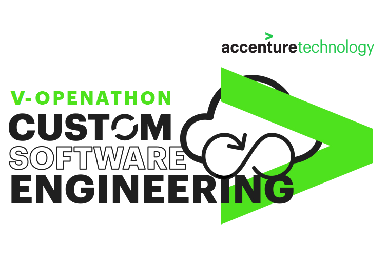

    

# Openathon V - Cloud

### ¡Bienvenidos al Openathon V! 

    

En este openathon tendremos la oportunidad de aprender, de manera práctica, los conceptos básicos de docker, crearemos imágenes para distintos tipos de proyectos y veremos cómo orquestrarlos.  

Los contenidos que os mostraremos en este openathon son los siguientes:

0. Play with Docker
1. Introducción a Docker y containerización
   1. Conceptos básicos de Docker
   2. Alternativas a Docker
   3. Orquestando contenedores
   4. Diferencias entre containerización

2. Dockerfiles
   1. ¿Qué es un Dockerfile?
   2. Crear una imagen con contenido estático 

3. Una pequeña práctica, ¡un hola mundo por supuesto!
   1. Dockerizar una aplicación web
   2. Dockerizar una aplicación Spring boot

4. PostgreSQL y volumenes persitentes con Docker
5. Creando un stack de servicios con Docker Compose
6. Escalado y orquetación de microservicios
7. Dockerización de la aplicación Event-UI

[ Lab 00. Play with Docker >](./lab-00)
	

    

