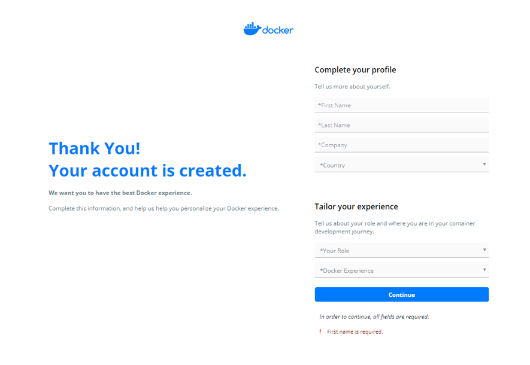
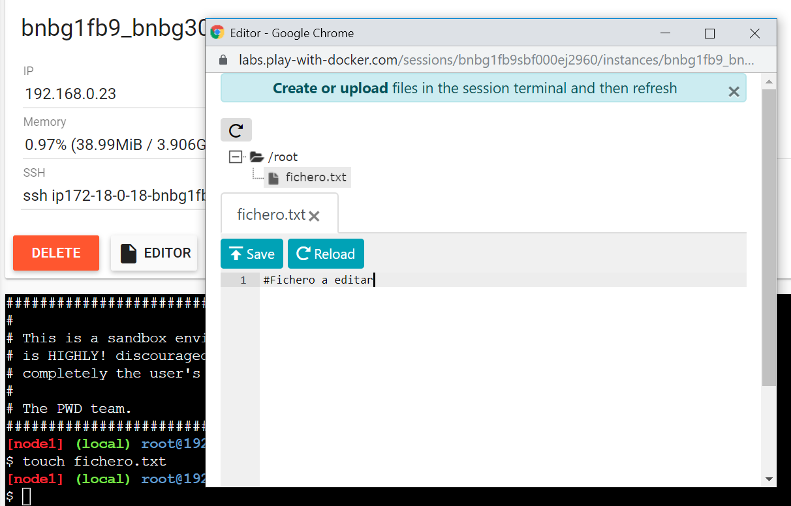

<p align="center">
    
</p>

# Lab 00 - Play with Docker
En este laboratorio vamos a mostrar como crear un usuario en Docker. Con el usuario creado podremos logarnos en https://labs.play-with-docker.com/,
que será la herramienta propuesta para realizar nuestros siguientes laboratorios ya que nos facilita una máquina virtual con docker instalado.
Al final del laboratorio tendrás un ejemplo de como es posible editar online un fichero ubicado en la máquina virtual.
<br/>

# Crear usuario en DockerHub

El primer paso necesario es crear una cuenta en Docker.com. Si ya dispones de una cuenta puedes ir al punto 2.

<p align="center">
    
</p>

Se hace clic sobre Sign In. Esto nos abrirá la siguiente ventana:

<p align="center">
    
</p>

Luego, haremos click sobre Sing Up, que nos llevará a:

<p align="center">
    
</p>

Aquí será necesario introducir un Docker ID, una password y un email para confimar el usuario. Al introducir los datos y hacer clic en continuar la cuenta estará creada.

<p align="center">
    
</p>

Nos pedirá que completemos el perfil. Habrá llegado también un mail para confirmar el usuario(Será necesario abrir el link)

<p align="center">
    
</p>

Es posible clicar en Return to Home Page y logarse para validar el usuario.

# Juguemos con la ballena

Para realizar las prácticas vamos a acceder a https://labs.play-with-docker.com/. Esta web nos facilita una máquina virtual durante 4 horas con Docker instalado.

<p align="center">
    
</p>

Al hacer click sobre Login, nos permitirá introducir nuestro usuario de Docker. Una vez logado podremos comenzar.

<p align="center">
    
</p>

<p align="center">
    
</p>

Haremos click en ADD NEW INSTANCE para crear una máquina virtual.

<p align="center">
    
</p>

Ya disponemos de la máquina virtual. Podemos comprobar que Docker está instalado.

<p align="center">
    
</p>

Como utilidad para el resto de laboratorios, es posible editar un fichero directamente desde la web. Para ello, el fichero debe existir previamente.
Para crear un fichero vacío desde línea de comandos podemos ejecutar lo siguiente:
```sh
touch fichero.txt
```
Cuando tengamos el fichero creado ya podrá ser seleccionado desde el botón Editor, donde se vusualizará un editor de texto que nos permitirá guardar el fichero.
<p align="center">
    
</p>


< [¡Bienvenidos al Openathon V!](../README.md) | [Lab 01 - Introducción a Docker y containerización](../lab-01)>


<p align="center">
    
</p>

