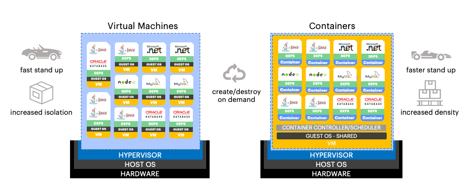
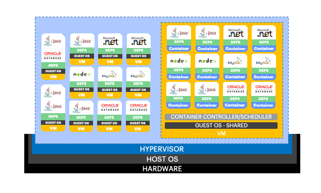

# Lab 01 - Introducción a Docker y containerización

## ¿Qué es containerización?

Uno de los principales retos a los que nos enfrentamos como ingenieros de software es el de garantizar que el trabajo que hacemos individualmente luego se traslada adecuadamente a un entorno productivo, además de por supuesto todos los entornos de validación intermedios que puedan existir.

Sufrimos con frecuencia el 'síndrome de funciona-en-mi-PC', que no es más que un reflejo de una forma de trabajar que no tiene en cuenta modelos de integración, empaquetado, distribución y ejecución consistentes sin importar dónde y cómo se hagan.

Mediante scripts y herramientas de automatización, hemos mejorado mucho en integración y empaquetado, y avanzado bastante en distribución; pero aun quedan muchos puntos por mejorar, sobre todo en ejecución. ¿Cuántas veces no ha fallado un pase a producción por un parámetro de configuración o un fichero que faltó por distribuir? Y aun más frecuente y con impactos más severos: ¿Cuántas veces se ha detectado un bug solamente en producción, puesto que en otros entornos no se puede reproducir? Productos y versiones que no coinciden, hardware que no se parece en nada en cada entorno, configuraciones de alta disponibilidad o de seguridad completamente diferentes, y tantas otras situaciones que aun hoy vivimos con cierta frecuencia.

La práctica de la containerización de aplicaciones ha cobrado relevancia en los últimos años porque viene a resolver gran parte de estas situaciones, aspirando a crear una mejor experiencia para desarrolladores y operadores de entornos.

Containerizar una aplicación es, explicado de forma sencilla, ejecutarla de forma aislada al resto de procesos en una misma máquina que la hospeda. Eso permite compartir mucho mejor los recursos físicos de un servidor, aumentando la densidad de aplicaciones, pero manteniendo el aislamiento entre ellas que nos de la seguridad necesaria tanto en el aspecto de 'security' como de 'certainty', aumentando la predecibilidad de nuestros sistemas.

La containerización no es una técnica nueva, sino que viene usándose desde hace más de 10 años en sistemas Linux. Linux incluye funcionalidades para aislar procesos unos de otros, aislar espacios de nombres y usuarios, o compartir recursos de computación: cgroups, kernel namespaces, libvirt, y muchas otras. Pero a pesar de no ser nueva, su uso no estaba extendido en la industria debido a la dificultad que tienen esas herramientas, que solo las hacía accesibles a unos pocos.

## ¿Qué es Docker?

Docker nace para superar precisamente esa barrera: hacer de la containerización algo sencillo, al alcance de todos. Es decir, Docker toma todos los conceptos existentes de containerización, y alguna de las librerías y herramientas existentes, para crear una plataforma nueva con un foco muy especial en la experiencia de desarrollo y operación. Que fuera, sobre todo, sencilla de aprender y de usar. Y lo consiguió.

En pocos años Docker se ha convertido en el estándar de industria para la containerización de aplicaciones, y ha abierto la puerta a muchos otros proyectos que lo complementan, extienden o tratan de competir con él. Y el formato que impulsó Docker para definir las imágenes ejecutables y empaquetarlas para su distribución, se ha convertido en el estándar abierto que usan prácticamente todas las tecnologías de containerización actuales.

## Conceptos básicos de Docker

Antes de comenzar con los laboratorios prácticos, veamos brevemente algunos de los conceptos básicos de Docker que manejaremos en más profundidad en las próximas horas:

- *Docker Engine*. El motor de Docker es el 'ejecutable', la pieza que sabe coger una imagen en disco y convertirla en un contenedor, es decir, un proceso productivo en una máquina host, con el debido aislamiento, acceso a recursos de computación y comunicación con el mundo exterior.

- *Docker Image*. Una imagen Docker es un fichero en disco que contiene toda la información de los ficheros, permisos, puertos de red, volúmenes o comando ejecutable al inicio, entre otros datos. Las imágenes Docker están estratificadas en capas, de forma que imágenes más complejas se basan en imágenes más sencillas, y solo deben llevar traza de los cambios sobre la imagen en la que se basan (p.ej. los ficheros nuevos, los que se han cambiado, etc.). Las imágenes Docker se guardan en registros desde las que son distribuidas cuando son necesarias (p.ej. Docker Hub, Docker Trusted Registry, Red Hat Quay, etc.). El formato de imagen Docker es a día de hoy un estándar de la Open Container Initiative y usado por otros motores aparte del propio Docker.

- *Docker Machine*. Es un host - ya sea servidor físico, virtual o PC - que tiene configurado Docker Engine y permite por tanto gestionar el ciclo de vida de las imágenes y ejecutarlas.

- *Docker Volume*. Un volumen en general es un espacio en disco para uso de un programa. En el caso específico de Docker, los volúmenes se asocian a contenedores (no a imágenes). Pueden ser efímeros que se destruyen al finalizar el proceso del contenedor (p.ej. el típico volumen /tmp) o persistentes (p.ej. el volumen donde guardamos los ficheros de una base de datos o de un gestor de contenido).

- *Docker Network*. Una red en Docker es una virtualización sobre las redes existentes en el host, que permite tener entornos privados aislados unos de otros, y configurar reglas que permitan o no los accesos entre redes y con el mundo exterior. Como regla básica, dos contenedores en la misma red Docker tienen visibilidad entre sí, pero no si están en redes diferentes. Otro concepto importante es el de puerto expuesto y publicado. Un puerto expuesto es un puerto del contenedor que es accesible a otros contenedores de la red (p.ej. el puerto de una base de datos). Un puerto publicado es un puerto que es accesible desde la máquina host y por tanto accesible desde el mundo exterior (p.ej. el puerto de escucha de una aplicación web).

## Alternativas a Docker

Aunque el formato de imagen de Docker se ha impuesto como estándar abierto, existen otros motores que permiten la ejecución de contenedores y la gestión de su ciclo de vida. Solo con el fin de que os suenen, listamos aquí los más conocidos:

- *lxc*. Motor de contenedores en Linux, que opera a un nivel más bajo que Docker, promovido por Canonical. Es un proyecto ya bastante antiguo y uno de los principales precursores a Docker en el área de la containerización.
- *cri-o*. Motor de contenedores muy orientado a su uso en Kubernetes y totalmente compatible con las imágenes Docker, promovido por Red Hat.
- *rkt* ('rocket'). Motor de contenedores del proyecto CoreOS. Desde la adquisición de CoreOS por parte de Red Hat, rkt ha evolucionado a cri-o.
- *Mesos*. Una de las principales alternativas a Docker en volumen de adopción. Soporta el formato de imagen estándar de Docker.
- *containerd*. Proyecto más reciente bajo el paraguas de la Cloud Native Computing Foundation. Cuenta con bastantes apoyos y además soporta el formato de imagen estándar de Docker.
- *Dyno*. Tecnología de contenedores propietaria de Heroku, basada igualmente en Linux. Desde hace pocos meses, Heroku soporta la ejecución de imágenes Docker como Dynos, además de mantener su propio enfoque basado en 'buildpacks'.
- *Warden*. Tecnología de contenedores en Linux utilizada por la plataforma Cloud Foundry.

## Orquestando contenedores

Aunque Docker es una gran ventaja para el problema de gestionar la distribución y ejecución de aplicaciones de una forma portable, difícilmente una aplicación consista en un solo contenedor. Normalmente nos encontraremos múltiples contenedores trabajando juntos (p.ej. app front, el backend, la base de datos), y en muchas ocasiones necesitaremos tener varias copias del mismo contenedor para absorber más carga de los usuarios, o para distribuirlas en múltiples host para ser resistente a los fallos.

Para gestionar contenedores a escala, es preciso contar con una plataforma que gestione los recursos de computación de uno o varios host, y que permita orquestar la ejecución de docenas, incluso cientos de contenedores, sin volvernos locos trabajando con ellos uno a uno.

Aunque no entraremos en profundidad en plataformas de orquestación de contenedores en esta ocasión (pero seguro que sí en la próxima), sí que es interesante comentar las principales para que os resulten familiares:

- *Docker Swarm*. La plataforma de orquestación de la propia Docker Inc. (la compañía detrás de Docker y Docker Enterprise, negocio recientemente adquirido por Mirantis). Muy sencilla de poner en marcha pero complicada de mantener en buena salud. Requiere realmente de una plataforma Docker Enterprise (comercial) para sacarle todo su partido.
- *Kubernetes*. El **rey** de las plataformas. Estándar de facto que se ha impuesto a todas las demás en cuota de adopción. Inicialmente fue una contribución de Google y luego muchas compañías han empezado a invertir estratégicamente en él, notablemente Red Hat.
- *Red Hat OpenShift*. Plataforma basada en Kubernetes, con un foco en la usabilidad y experiencia de desarrollo.
- *RancherOS*. Desde su versión 2.0, plataforma basada en Kubernetes, compartiendo el foco en la usabilidad y experiencia de otras opciones.
- *Mesosphere*. La plataforma de orquestación de Mesos.
- *Amazon Web Services ECS, Elastic Container Service*. Plataforma de orquestación propietaria de Amazon Web Services.
- *Amazon Web Services EKS, Elastic Kubernetes Service*. Plataforma basada en Kubernetes gestionada por Amazon Web Services.
- *Google Cloud GKE, Google Kubernetes Engine*. Plataforma basada en Kubernetes gestionada por Google Cloud.
- *Microsoft Azure AKS, Azure Kubernetes Service*. Plataforma basada en Kubernetes gestionada por Microsoft Azure.
- *Microsoft Azure ARO, Azure Red Hat OpenShift*. Plataforma basada en OpenShift gestionada por Microsoft Azure.

## Diferencias entre containerización y máquinas virtuales

En este punto, posiblemente muchos os preguntáis cuál es la diferencia entre Docker y una máquina virtual de "toda la vida", como VirtualBox, VMware o Hyper-V.

Ambos enfoques de virtualización son complementarios, con sus pros y contras. En el caso de las máquinas virtuales, la unidad de virtualización es el host virtual, lo que incluye, sobre el hipervisor, un stack completo con sistema operativo, librerías y dependencias, y finalmente la aplicación virtualizada. En el caso de los contenedores, la unidad de virtualización comienza más "arriba", sobre el sistema operativo.

Eso quiere decir que en un mismo host físico que proporciona la capacidad de virtualizar con contenedores, todos ellos comparten el kernel del sistema operativo, lo que puede ocasionar ciertas incompatibilidades llegado el caso (p.ej. imágenes que dependen de glibc).

Sin embargo, en un enfoque con máquinas virtuales, como la virtualización incluye al sistema operativo, el mismo host físico puede alojar diferentes sistemas, p.ej. máquinas Windows o Linux conviviendo en el mismo host.

Las máquinas virtuales son rápidas de iniciar, pero los contenedores lo son aun más, puesto que no deben iniciar el sistema operativo. Las máquinas virtuales ofrecen un mayor aislamiento entre aplicaciones, y darán menos problemas derivados de incompatibilidad en el kernel (incluso aunque sean distintas aplicaciones basadas en Linux).

Gráficamente, podemos verlo en el siguiente diagrama:

Ambos enfoques además pueden convivir y dentro de un mismo host físico que lo soporta, se pueden desplegar máquinas virtuales y contenedores simultáneamente, consiguiendo en una sola plataforma lo mejor de ambos mundos:

## Conclusión

Una vez vistos los conceptos principales de Docker y de la containerización, pasaremos a los laboratorios prácticos donde desarrollaremos estos conceptos paso a paso.
