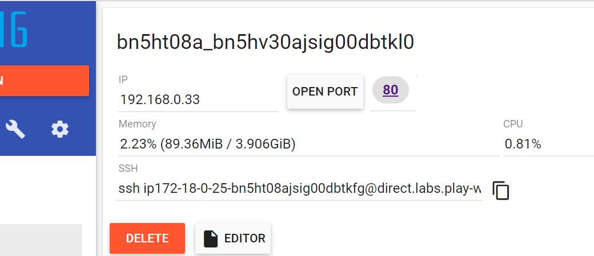
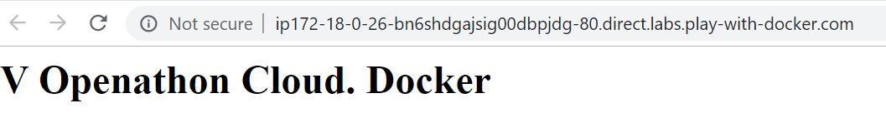

<p align="center">
    
</p>

# Lab 02 - Dockerfiles
En este laboratorio vamos a aprender que es un Dockerfile y cómo podemos usarlo para la creación de imágenes Docker.
Crearemos un Dockerfile de ejemplo para convertirlo en imagen y hacerla correr en un contenedor.
También realizaremos un ejemplo donde se copiará contenido a una imagen mediante Dockerfile.

<br/>
<p align="center">

<br/>
</p>
<br/>

## ¿Qué es un DockerFile?

Un Dockerfile es un archivo de texto plano que contiene una serie de instrucciones necesarias para crear una imagen que, posteriormente, se convertirá en una sola aplicación utilizada para un determinado propósito.

Docker puede construir imágenes automáticamente leyendo las instrucciones de un Dockerfile.

Ejemplo de Dockerfile:

```sh
# Descarga la imagen de Ubuntu 18.04
FROM ubuntu:18.04
# Actualiza la imagen base de Ubuntu 18.04
RUN apt-get update
# Instalar Git
RUN apt-get -qqy install git
```

### Imágenes a medida con Dockerfile

Docker puede construir imágenes automáticamente, leyendo las instrucciones indicadas en un fichero Dockerfile. 
Los pasos principales para crear una imagen a partir de un fichero Dockerfile son:
  - Crear un nuevo directorio que contenga el fichero y otros ficheros que fuesen necesarios para crear la imagen.
  - Crear el contenido.
  - Construir la imagen mediante el comando docker build.

La sintaxis del comando es:
```sh
docker build [opciones] RUTA | URL | -
```
Las opciones más comunes son:

-   -t, nombre [:etiqueta]. Crea una imagen con el nombre y la etiqueta especificada a partir de las instrucciones indicadas en el fichero. Es recomendable asignar siempre un nombre a las imágenes que creamos.
-   –no-cache. Establecida por defecto, Docker guarda en memoria caché las acciones realizadas recientemente. Si se diese el caso de que ejecutamos un docker build varias veces, Docker comprobará si el fichero contiene las mismas instrucciones y, en caso afirmativo, no generará una nueva imagen. Para generar una nueva imagen omitiendo la memoria caché utilizaremos siempre esta opción.
-   –pull. También por defecto. Docker solo descargará la imagen especificada en la expresión FROM si no existe en el repositorio local. Para forzar que descargue la nueva versión de la imagen utilizaremos esta opción.
-   –quiet. Por defecto, se muestra todo el proceso de creación, los comandos ejecutados y su salida. Utilizando esta opción solo mostrará el identificador de la imagen creada.
### Vamos a crear nuestra primera imagen con Dockerfile
El primer paso es crear un directorio
```sh
mkdir laboratorio2a
```
Accedemos al nuevo directorio
```sh
cd laboratorio2a
```
Creamos un nuevo fichero Dockerfile(podemos hacer uso del editor o bien con el comando vi)
```sh
vi Dockerfile
```
Vamos a crear una imagen que parta de la última versión de Ubuntu, realice una actualización de los paquetes, realice una instalación de git y ejecute el comando bash. Para ello escribimos el siguiente contenido en el fichero:

```sh
FROM ubuntu:latest
RUN apt-get -y update; 
RUN apt-get -y install git;
CMD ["bash"]
```

Para guardar los cambios pulsamos sobre la tecla escape y escribimos :wq.
Una vez creado el fichero y editado, lo guardamos. Ahora realizamos la construcción de la imagen:

```sh
docker build  -t "laboratorio2a:v1" .
```
Si todo ha ido bien, aparecerá un mensaje como el siguiente:
```sh
Successfully tagged laboratorio2a:v1
```
Comprobaremos que la imagen está disponible ejecutando docker images
```sh
[node1] (local) root@192.168.0.23 ~/laboratorio2a
$ docker images
REPOSITORY          TAG                 IMAGE ID            CREATED             SIZE
laboratorio2a       v1                  5a00a1083e8d        30 seconds ago      186MB
ubuntu              latest              775349758637        2 weeks ago         64.2MB
```

Ahora vamos a crear un contenedor a partir de la imagen. Para ello ejecutaremos lo siguiente:

```sh
docker run -dti --name containerlaboratorio2a 5a00a1083e8d
```
Siendo 5a00a1083e8d el IMAGE ID de nuestra imagen.
Con la opción --name asignamos un nombre a nuestro contenedor.

Ejecutamos docker ps para verificar que el contenedor está levantado:
```sh
[node1] (local) root@192.168.0.23 ~/laboratorio2a
$ docker ps
CONTAINER ID        IMAGE               COMMAND             CREATED             STATUS              PORTS               NAMES
75aafc1d84df        5a00a1083e8d        "bash"              39 seconds ago      Up 37 seconds                           containerlaboratorio2a
```
Por último, vamos a verificar que el contenedor está arrancado y tiene git instalado. Para ello ejecutamos la siguiente instrucción, que nos abrirá un bash sobre nuestro contenedor:

```sh
[node1] (local) root@192.168.0.23 ~/laboratorio2a
$ docker exec -i -t containerlaboratorio2a /bin/bash
root@5d8723797fd0:/# git --version
git version 2.17.1
```
Finalmente, escribimos exit para volver a la máquina virtual.


### Instrucciones Dockerfile
Aunque en esta [URL](https://docs.docker.com/develop/develop-images/dockerfile_best-practices/) disponemos de detalle sobre las distintas instrucciones y mejores prácticas para escribir Dockerfiles aquí mostramos un resumen con las más importantes.

FROM: Indica la imagen base sobre la que se construirá la aplicación dentro del contenedor. Todos los Dockerfiles comienzan con un FROM.
```sh
FROM  <imagen>
FROM  <imagen>:<tag>
```

RUN: Nos permite ejecutar comandos en el contenedor.
```sh
RUN  <comando>
```
CMD: Se encarga de pasar valores por defecto a un contenedor. Entre estos valores se pueden pasar ejecutables.
```sh
CMD [“ejecutable”, “parametro1”, “parametro2”, …]

CMD [“parametro1”, “parametro2”, ….]
```
La segunda opción se utiliza para pasar parámetros al comando EntryPoint.

A diferencia del comando RUN,   que se utiliza para crear la imagen de un contenedor, CMD se ejecuta una vez que el contenedor se ha inicializado.

ENTRYPOINT: Se utiliza cuando se quiere ejecutar un ejecutable en el contenedor en su arranque.
```sh
ENTRYPOINT "comando" "parametro1" "parametro2"
```
ENV: Establece variables de entorno dentro del contenedor.
```sh
ENV  <clave> <valor>
```
ADD: Esta instrucción se encarga de copiar los ficheros y directorios desde una ubicación especificada y los agrega al sistema de ficheros del contenedor.

```sh
ADD <fuente> <destino>
```

MAINTAINER: Nos permite configurar datos del autor del Dockerfile, principalmente su nombre y su dirección de correo electrónico.
```sh
MAINTANER <nombre> <"correo">
```
LABEL: Nos permite añadir metadatos a nuestra imagen.
```sh
LABEL <clave> <valor>
```


COPY: La instrucción copia ficheros y directorios de un path origen y los añade a un path destino dentro del contenedor.
```sh
COPY <origen> <destino>
```

EXPOSE: Indica los puertos en los que va a escuchar el contenedor. Con ello, los puertos no serán accesibles desde el host, para esto será necesario utilizar la exposición de puertos mediante la opción -p de docker run.
```sh
EXPOSE <puerto>
```
VOLUME: Esta instrucción crea un volumen como punto de montaje dentro del contenedor y es visible desde el host anfitrión.
```sh
VOLUME <path>
```
WORKDIR: Establece el directorio por defecto para la ejecución de las instrucciones RUN, CMD, ENTRYPOINT, COPY y ADD siguientes en el Dockerfile.
```sh
WORKDIR <path>
```
USER: Por defecto, todas las acciones son realizadas por el usuario root. Aquí podemos indicar un usuario diferente.
```sh
USER <usuario>
```
### Docker run
En esta [URL](https://docs.docker.com/engine/reference/commandline/run/) podemos encontrar detalle de todas las opciones disponibles para la ejecución de un docker run.


```sh
docker run [OPCIONES] IMAGEN [COMANDO] [ARGUMENTOS...]
```

## Crear imagen con contenido estático
Es posible crear una imagen que muestre contenido estático. Para ello podemos hacer uso de [nginx](https://es.wikipedia.org/wiki/Nginx) para que nos provea del enrutado.

Vamos a realizar un ejemplo de ello. Lo primero es crear un nuevo directorio para realizar la práctica:

```sh
mkdir laboratorio2b
```
Accedemos al nuevo directorio:

```sh
cd laboratorio2b
```

Vamos a proceder a crear el contenido estático que queremos mostrar. En este caso una etiqueta simple HTML y lo guardaremos en un fichero index.html.
Para ello, podemos hacer uso de vi o bien usar el editor.

```sh
vi index.html
```

Guardamos el fichero. En nuestro caso con contenido:  
`<h1>V Openathon Cloud. Docker</h1>`

Ahora vamos a crear un Dockerfile con el mismo procedimiento. El contenido será el siguiente:

```sh
  FROM nginx:alpine
  COPY . /usr/share/nginx/html
```
Se parte de una imagen de nginx y copiamos nuestro contenido (fichero index.html) al directorio /usr/share/nginx/html.

El siguiente paso es crear una imagen para este Dockerfile. 

```sh
  docker build -t practicanginx:v1 .
```

¿Sabrías como comprobar que se ha creado la imagen?

```sh
 [node1] (local) root@192.168.0.33 ~/laboratorio2b
$ docker images
REPOSITORY          TAG                 IMAGE ID            CREATED             SIZE
practicanginx       v1                  0f6dbc295378        21 minutes ago      21.4MB
nginx               alpine              b6753551581f        2 weeks ago         21.4MB
```
Ahora vamos a levantar el contenedor:
```sh
  docker run -d -p 80:80 practicanginx:v1 
```
Con -p informamos el puerto que expone el contenedor. Como podemos ver, podemos levantar un contenedor a partir de una imagen y tag. 

¿Sabrías comprobar que el contendor está arrancado?¿Qué nombre de contenedor le ha asignado si lo informamos con --name?
```sh
[node1] (local) root@192.168.0.33 ~/laboratorio2b
$ docker ps
CONTAINER ID        IMAGE               COMMAND                  CREATED             STATUS              PORTS                NAMES
e62f948c8f89        practicanginx:v1    "nginx -g 'daemon of…"   25 minutes ago      Up 25 minutes       0.0.0.0:80->80/tcp   distracted_vaughan
```
No solo eso, ahora podemos ver que un nuevo link ha aparecido en nuestra ventana, informando que el puerto 80 está a la escucha. 
<br/>
<p align="center">

<br/>
</p>
<br/>
Si abrimos el link podremos ver el contenido de nuestro HTML en una nueva ventana:
<br/>
<p align="center">

<br/>
</p>
<br/>

[< Lab 01 - Introducción a Docker](../lab-01/) | [ Lab - 03 Una pequeña práctica, un "Hola Mundo" por supuesto. >](../lab-03)
<p align="center">
    
</p>


