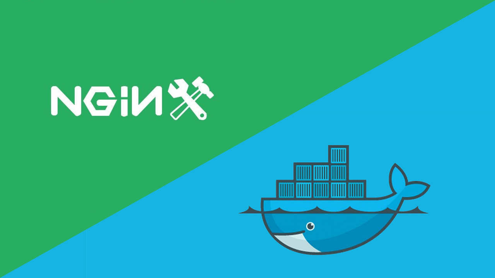
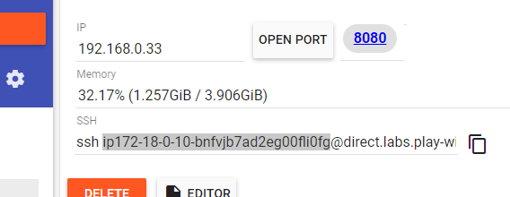
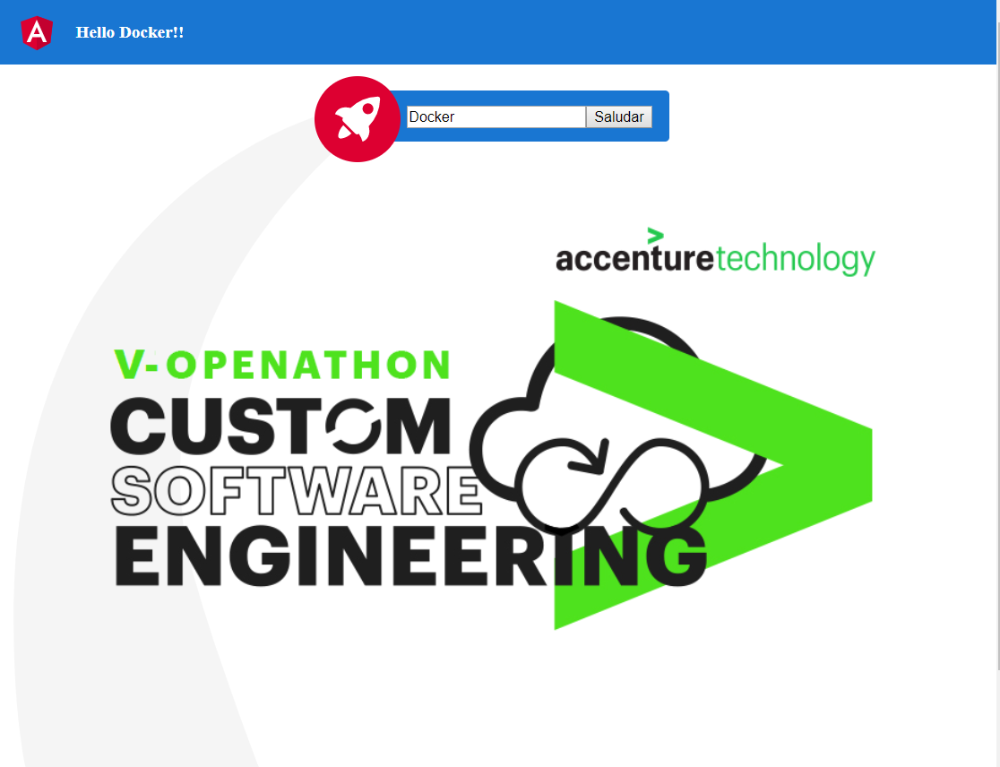

<p align="center">
    
</p>

# Lab 03. Frontend - Haciendo el despliegue de un HelloWorld con Docker y Nginx

<br/>

<p align="center">

<br/>
¡Despleguemos con Docker y Nginx!
</p>
<br/>

## Objetivos y resultados
El objetivo de este laboratorio es **crear una imagen Docker** que contenga todo lo necesario para desplegar una aplicación web **HelloWorld en un servidor Nginx**. Esta imagen estaría **lista para ser desplegada** en nuestro entorno de producción.

<br/>

## Generar una nueva imagen y un contenedor para desplegar nuestra aplicación.

Para comenzar este laboratorio vamos a partir de una aplicación web **HelloWorld** que hemos creado para la ocasión.

<p align="center">
    
<br/>
Nuestra aplicación HelloWorld
</p>
<br/>

Es una aplicación muy básica realizada con Angular. En la barra superior muestra inicialmente el típico saludo **"Hello World!!"**. En la zona central de la pantalla, justo debajo de la barra superior, aparece un formulario que nos pide que introduzcamos nuestro nombre. Si lo introducimos y pulsamos el botón "Saludar", la aplicación tomará el nombre introducido y se lo enviará al servidor para que este le devuelva un saludo personalizado. Si todo va bien, el saludo obtenido sustituirá al saludo existente en la barra superior. Si por cualquier motivo no se pudiera obtener el saludo personalizado se utilizaría un saludo personalizado por defecto.

### Paso 1. Clonar el proyecto HelloWorld a la máquina virtual

Vamos a clonar el proyecto HelloWorld en la misma máquina virtual que hemos usado en los laboratorios anteriores. Para ello ejecutaremos el siguiente comando en la carpeta home del usuario:
```sh
cd
git clone https://github.com/Accenture/openathon-2019-docker-angular-app.git
```
Como resultado obtendremos lo siguiente:

```sh
$ git clone https://github.com/Accenture/openathon-2019-docker-angular-app.git
Cloning into 'angular_app'...
remote: Enumerating objects: 61, done.
remote: Counting objects: 100% (61/61), done.
remote: Compressing objects: 100% (46/46), done.
remote: Total 61 (delta 14), reused 60 (delta 13), pack-reused 0
Unpacking objects: 100% (61/61), done.
```

Cuando finalice la descarga, tendremos una nueva carpeta llamada **openathon-2019-docker-angular-app**. Accederemos a su interior con el siguiente comando:
```sh
cd openathon-2019-docker-angular-app
```

### Paso 2. Hacer pull de las imágenes Docker que usaremos como base.

Para construir la imagen Docker que contenga nuestra aplicación y el servidor web **Nginx** vamos a utilizar como base otras dos imágenes:

- [Imagen de Node.js](https://hub.docker.com/_/node): Contiene una instalación de Node.js que vamos a necesitar para "compilar" la aplicación.
- [Imagen de Nginx](https://hub.docker.com/_/nginx): Contiene una instalación de Nginx que usaremos como servidor web para publicar nuestra aplicación.

Para hacer el pull de ambas imágenes tan solo tenemos que ejecutar los siguientes comandos en nuestro terminal:

```sh
docker pull node
```

```sh
docker pull nginx
```

Si todo va bien, después de completar la descarga, ambas imágenes deben aparecer en nuestra lista tras ejecutar el siguiente comando:

```sh
docker images
```
Como resultado obtendremos lo siguiente:

```sh
[node1] (local) root@192.168.0.48 ~/openathon-2019-docker-angular-app
$ docker images
REPOSITORY          TAG                 IMAGE ID            CREATED             SIZE
nginx               latest              4152a9608752        2 days ago          126MB
node                latest              1a77bcb355eb        2 weeks ago         933MB
```

### Paso 3. Revisemos el fichero de configuración para Nginx.

Para que nuestra aplicación Angular se despliegue y funcione correctamente necesitaremos un fichero de configuración básico para el servidor web Nginx. En este fichero, llamado **nginx.conf**, se especifican cosas como el puerto en el que se publicará, la ruta del directorio raíz, las rutas permitidas, etc. En esta [URL](http://nginx.org/en/docs/beginners_guide.html#conf_structure) puedes obtener más detalles sobre su estructura. 

Este fichero ya se encuentra en la carpeta raíz de la aplicación. Puedes consultarlo en https://github.com/Accenture/openathon-2019-docker-angular-app/blob/master/nginx.conf. Su contenido se muestra a continuación:

```Nginx
worker_processes  1;
 
events {
  worker_connections  1024;
}
 
http {
  server {
    listen 80;
    server_name  localhost;
 
    root   /usr/share/nginx/html;
    index  index.html index.htm;
    include /etc/nginx/mime.types;
  
    location / {
      try_files $uri $uri/ /index.html;
    }

    location /assets/img/ {
    }
  }
}
```

### Paso 4. Revisemos el fichero Dockerfile.

También necesitamos un fichero **Dockerfile** para indicar a Docker cuál será el contenido de la nueva imagen que vamos a crear. En esta [URL](https://docs.docker.com/engine/reference/builder/) puedes obtener información detallada sobre los ficheros **Dockerfile**.

Este fichero ya se encuentra en la carpeta raíz de la aplicación. Puedes consultarlo en https://github.com/Accenture/openathon-2019-docker-angular-app/blob/master/Dockerfile. Su contenido se muestra a continuación:

```Dockerfile
# Utilizamos la imagen de node como base ya que la necesitamos para "compilar" los fuentes del proyecto Angular. Denominaremos a esta imagen "build"
FROM node as build

# Recogemos el argumento de entrada si existe, si no usaremos el valor por defecto (localhost)
ARG ARG_API_URL=localhost

# Asignamos a la variable de entorno API_URL el valor del argumento de entrada definido en el paso anterior.
# Esta variable de entorno la utiliza el compilador de Angular para establecerla en el momento de la "compilación"
ENV API_URL=$ARG_API_URL

# Copiamos el fichero package.json a una nueva carpeta de trabajo
COPY ./package.json /usr/angular-workdir/
WORKDIR /usr/angular-workdir

# Lanzamos el comando npm install para que node se descargue todas las dependencias
# definidas en nuestro fichero package.json
RUN npm install

# Copiamos todo el código del proyecto a la carpeta de trabajo
COPY ./ /usr/angular-workdir

# Ahora que tenemos todas las dependencias y todo el código podemos generar 
# nuestro entregable ejecutando el siguiente comando.
RUN npm run buildProd

# Llega el momento de preparar el servidor web, para ello usaremos la imagen base
# de Nginx
FROM nginx

# Copiamos el fichero nginx.conf a la ruta adecuada en la imagen nginx
COPY ./nginx.conf /etc/nginx/nginx.conf

# Borramos todos los ficheros que pudieran existir en la ruta donde desplegaremos 
# el desplegable que hemos generado antes 
RUN rm -rf /usr/share/nginx/html/*

# Finalmente copiamos nuestro entregable desde la imagen de node a la ruta de despliegue
# en la imagen de Nginx 
COPY --from=build /usr/angular-workdir/dist/HelloWorld /usr/share/nginx/html
```

En este fichero Dockerfile se especifican los pasos que hay que dar para generar la imagen tal y como la queremos. Los comentarios incluidos en el fichero te indican en que consiste cada paso y cuál es su finalidad.

En esta [URL](https://docs.docker.com/develop/develop-images/dockerfile_best-practices/) puedes consultar las distintas instrucciones y mejores prácticas para escribir Dockerfiles.

### Paso 5. Crear la nueva imagen a partir del fichero Dockerfile.

Con todos los ingredientes que tenemos, ahora tan solo nos queda pedirle a Docker que siga los pasos descritos en el *Dockerfile* para elaborar la imagen, como si de una receta de cocina se tratase. Para ello usaremos el comando *build* con una serie de parámetros que detallamos a continuación:

- *-t*: Nos permite asignar un tag (nombre) a la imagen. En este caso el nombre será "helloworld"
- *--build-arg*: Nos permite especificar un parámetro de entrada que se utilizará en la ejecución del Dockerfile. En este caso nuestro Dockerfile recoge un parámetro opcional denominado **ARG_API_URL** en el que debemos indicar el nombre del host al que la aplicación se intentará conectar para obtener el saludo personalizado. Para obtener el nombre del host adecuado para usarlo en *Play with Docker* debemos construirlo siguiendo los siguientes pasos:
1. Obtenemos el identificador de nuestra instancia de *Play with Docker* que podemos obtener de la primera sección (hasta la @) de la URL para la conexión mediante SSH. En la siguiente imagen se muestra un **ejemplo** remarcando la sección que representa el identificador. **Atención:** No confundir con el identificador mostrado justo encima de la IP. Son parecidos pero no iguales.

<p align="center">

</p>

2. Concatenarle la siguiente cadena al final: **-8080.direct.labs.play-with-docker.com**

El resultado final debería tener un aspecto parecido a del siguiente **ejemplo**:

<p align="center">

</p>

Ahora tan solo nos queda construir el comando completo sustituyendo la etiqueta *< HOST >* por el identificador que acabamos de construir y lo ejecutamos en la consola:
    
> **ATENCION:** Asegurate de construir correctamente el identificador y sustituirlo por *< HOST >* en el comando, de lo contrario la imagen que se generará será incapaz de conectarse al servidor cuando la usemos en los próximos laboratios.

```sh
docker build -t helloworld --build-arg ARG_API_URL=<HOST> .
```

La ejecución puede tardar más de un minuto e irá mostrando el resultado de la ejecución de cada uno de los pasos incluidos en el fichero Dockerfile. 

> Es posible que se muestre algún mensaje de Warning pero podemos ignorarlos.

Si todo va bien, nuestra nueva imagen aparecera, junto a las de node y nginx, en nuestra lista de imágenes si ejecutamos el siguiente comando:
```sh
docker images
```
Como resultado obtendremos lo siguiente:

```sh
[node1] (local) root@192.168.0.48 ~/openathon-2019-docker-angular-app
$ docker images
REPOSITORY          TAG                 IMAGE ID            CREATED             SIZE
helloworld          latest              889203080254        13 minutes ago      127MB
<none>              <none>              4c002681fcca        13 minutes ago      1.27GB
nginx               latest              4152a9608752        2 days ago          126MB
node                latest              1a77bcb355eb        2 weeks ago         933MB
```

> La imagen identificada como < none > es una imagen temporal que se ha creado en este proceso.

### Paso 6. Ejecutar nuestra nueva imagen para generar un nuevo contenedor.

Ahora que tenemos lista nuestra nueva imagen docker tan solo nos queda ejecutarla y crear así nuestro contenedor que arrancará el servidor web Nginx con nuestro HelloWorld.

Para ellos vamos a ejecutar el siguiente comando:
```sh
docker run -d -p 80:80 --name "helloWorld" helloworld
```

Si todo va bien, en el panel superior de la máquina virtual se mostrará junto al botón *OPEN PORT* un nuevo enlace indicando que la aplicación está publicada en el **puerto 80**. Si pulsamos el enlace se abrirá una nueva pestaña donde podremos ver nuestra aplicación **HelloWorld**.

<p align="center">
  
  <br/>
  ¡HelloWorld desplegado en Nginx!
</p>

También podemos ver que nuestro nuevo contenedor está en ejecución con el siguiente comando:
```sh
docker ps
```

Como resultado obtendremos lo siguiente:
```sh
[node1] (local) root@192.168.0.48 ~/openathon-2019-docker-angular-app
$ docker ps
CONTAINER ID        IMAGE               COMMAND                  CREATED             STATUS              PORTS                NAMES
7ed0c8cec8e3        helloworld          "nginx -g 'daemon of…"   7 minutes ago       Up 7 minutes        0.0.0.0:80->80/tcp   xenodochial_archimedes
```

<br/>

### Paso 7. Detener y eliminar el contenedor.

Como paso final, después de haber disfrutado de esta magnífica aplicación :), vamos a parar y eliminar el contenedor con el siguiente comando:

```sh
docker rm -f helloWorld
```

Y verificamos que ya no está en ejecución con este otro:

```sh
docker ps
```

## Resumen
Hemos clonado una aplicación web hecha con Angular. Hemos creado una nueva imagen a partir otras dos (Node y Nginx) y en ella hemos incluido un servidor Nginx que publica nuestra aplicación web. Luego hemos generado un contenedor a partir de esa imagen y hemos comprobado que la aplicación se publica tal y como esperábamos.

[< Lab - 03. Una pequeña práctica, un "Hola Mundo" por supuesto. ](../README.md) | [ Lab 03. Backend >](../backend)

<p align="center">
    
</p>

