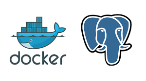

<p align="center">
    
</p>

# Lab 04 - PostgreSQL y volúmenes persistentes con docker
<br/>
<p align="center">

<br/>
¡Persistiendo datos!
</p>
<br/>

## Objetivos y resultados
El objetivo de este laboratorio es crear una imagen oficial de la base de datos **PostgreSQL** y la creación de un volumen persistente de datos.
Como resultado, obtendremos un contenedor con una instancia de la base de datos PostgreSQL donde crearemos una tabla para guardar saludos en diferentes idiomas.

En primer lugar, veremos una introducción a los volúmenes en docker y cómo administrarlos.
<br/>
## Uso de volúmenes
 El uso de volúmenes de datos es fundamental para compartir datos en entornos dockerizados. Hasta ahora, los ficheros que hemos creado en un contenedor permanecen o están disponibles mientras el contendor no sea borrado, es decir, la información es volátil y está ligada al ciclo de vida del contenedor. Sin embargo, las aplicaciones necesitan persistir y compartir datos.
 
 Los volúmenes no son más que carpetas en nuestro sistema de ficheros que son capaces de sobrevivir al ciclo de vida del contenedor. 
 El volumen de datos no es parte del sistema de ficheros del propio contenedor, si no que tiene su propio ciclo de vida independiente. Se alojan fuera del contenedor, en el propio sistema de archivos del host donde está corriendo docker, de tal manera que podemos cambiar, parar o borrar un contenedor sin que afecte a los datos.
 <br/>
## ¿Cuál es la ventaja de usar volúmenes?
Los volúmenes son el mecanismo preferido para los datos persistentes generados y usados por los contenedores docker. Además de la persistencia de datos, el uso de volúmenes nos aporta las siguientes ventajas:
- Funcionan tanto en contenedores de Linux como de Windows
- Los volúmenes se pueden compartir de forma segura entre contenedores
- Volúmenes nuevos pueden contener contenido cargado previamente por un contenedor
- Mediante drivers específicos nos permiten almacenar volúmenes en hosts remotos o proveedores en la nube, cifrar el contenido del volumen o incluso añadir otras funcionalidades

En este laboratorio cubriremos funcionalidades básicas de uso con volúmenes, como la administración y compartición de datos. Si deseas profundizar más, en la [documentación oficial](https://docs.docker.com/storage/) encontrarás más información sobre almacenamiento en docker.
<br/>

## ¿Cómo funciona?
Podemos crear y administrar volúmenes fuera del ámbito de un contenedor. El comando `docker volume` proporciona los subcomandos:
- `create`: crea un nuevo volumen
- `inspect`: muestra información detallada sobre uno o más volumenes
- `ls`: lista los volúmenes en el Docker host
- `rm`: elimina un volumen

Pongamos en práctica estos comandos y desde la una nueva instancia de la máquina virtual que hemos usado en laboratorios anteriores vamos a ejecutar los comandos anteriores.

**Crear un volumen**
```sh
# volumen create: comando creación de volumen
# mi-volumen: nombre del volumen
docker volume create mi-volumen
```
> La consola mostrará el nombre del volumen creado
```sh
mi-volumen
```

**Listar volúmenes**
```sh
# volume ls: comando listar volúmenes
docker volume ls
```
> Podemos comprobar el volumen mi-volumen listado
```sh
DRIVER              VOLUME NAME
local               mi-volumen
```

**Inspeccionar un volumen**
```sh
# volume inspect: comando mostar información detallada de un volumen
# mi-volumen: nombre de volumen
docker volume inspect mi-volumen
```

> Veremos las propiedades del volumen y el punto de montaje dónde está almacenado en el host `/var/lib/docker/volumes/mi-volumen/_data`

```sh 
[
    {
        "CreatedAt": "2019-11-23T18:03:18Z",
        "Driver": "local",
        "Labels": {},
        "Mountpoint": "/var/lib/docker/volumes/mi-volumen/_data",
        "Name": "mi-volumen",
        "Options": {},
        "Scope": "local"
    }
]
```

**Eliminar un volumen**
```sh
# volume rm: comando borrar volumen
# mi-volumen: nombre de volumen
docker volume rm mi-volumen
```
> La consola mostrará el nombre del volumen borrado
```sh
mi-volumen
```

## Creación de la base de datos con PostgreSQL
Ahora que sabemos como administrar un volumen, vamos a asociarlo a un contendor para guardar la información generada por el contenedor en el volumen.  

### Paso 1. Generar una nueva imagen e iniciar un contenedor con PostgreSQL.
Para construir nuestra imagen docker vamos a utilizar cómo base la imagen oficial:
- [Imagen de PostgreSQL](https://hub.docker.com/_/postgres): contiene una instalación de PostgreSQL.

En una única instrucción descargaremos la imagen e iniciaremos el contenedor con el volumen de datos asociado.

Vamos a usar el comando `docker run` para iniciar un nuevo contenedor de postgres con el nombre de **postgres-openathon**  y exponer el puerto 5432 por defecto en PostgreSQL.

El volumen que vamos a montar lo identificaremos como **postgres-data**, docker lo creará siempre que no exista un volumen con el mismo nombre. El volumen se montará en el directorio del propio host con el nombre `postgres-data` y lo mapearemos contra el contenedor en `/var/lib/postgresql/data`, ubicación por defecto donde PostgreSQL almacena los datos. Esto nos asegura que los datos persisten incluso después de que el contenedor sea eliminado.

Si es la primera vez que ejecutamos el comando, se hará pull de la imagen. Una vez descargada, iniciará el contenedor y montará el volumen. Tan sólo tenemos que ejecutar el siguiente comando en nuestro terminal:

```sh
# run: ejecuta un comando en un nuevo contenedor
# -d indica que el comando se va a ejectuar en modo background
# -p  <puerto-host:puerto-contenedor>: bindea el puerto del host al puerto del contedor
# -v <nombre volumen>:<ubicacion en contenedor>
# --name <nombre contenedor>
# postgres: nombre de la imagen
docker run -d -p 5432:5432 -v postgres-data:/var/lib/postgresql/data --name postgres-openathon postgres
```
> En la salida podemos ver que se hace pull de la imagen a Docker Hub al no contar con la imagen de postgres en local
```sh
Unable to find image 'postgres:latest' locally
latest: Pulling from library/postgres
000eee12ec04: Pull complete 
7b8ef50e8d64: Pull complete 
304f7c67e7db: Pull complete 
9fe4298c8c65: Pull complete 
f1ca857656d1: Pull complete 
95d6c34812f7: Pull complete 
9436c546bd1d: Pull complete 
922326a079d9: Pull complete 
d6e9dcf0d140: Pull complete 
83ac3914c283: Pull complete 
5ffbf9359c6e: Pull complete 
d280abe82126: Pull complete 
a664bb46d153: Pull complete 
ab39bf657a9d: Pull complete 
Digest: sha256:0bc3f724e4779908e67c6fe7bf47766c618681bacce487e28dd3f80fc76bd2e8
Status: Downloaded newer image for postgres:latest
f4e7aae5e28e684ac4fb08fa14ad6d6a4f84176b1023124f1c902ab5bb6d5f32
```

Podemos comprobar que está corriendo el contenedor con el comando
```sh
# ps: comando que muestra los contenedores por defecto los que están en ejecución
docker ps
```

> Vemos que nuestro contenedor está en ejecución y observamos el bindeo del puerto 5432 que establecimos
```sh
CONTAINER ID        IMAGE               COMMAND                  CREATED             STATUS              PORTS                    NAMES
f4e7aae5e28e        postgres            "docker-entrypoint.s…"   3 minutes ago       Up 3 minutes        0.0.0.0:5432->5432/tcp   postgres-openathon
```

Con `docker logs <nombre contenedor>` podemos ver la salida de log del contenedor y la información del proceso del servicio de PostgreSQL
```sh
# logs: comando que obtiene el log del contenedor
# postgres-openathon: nombre del contenedor
docker logs postgres-openathon
```
> Veremos una salida como la siguiente
```sh
2019-11-23 20:20:55.218 UTC [1] LOG:  starting PostgreSQL 12.1 (Debian 12.1-1.pgdg100+1) on x86_64-pc-linux-gnu, compiled by gcc (Debian 8.3.0-6) 8.3.0, 64-bit
2019-11-23 20:20:55.219 UTC [1] LOG:  listening on IPv4 address "0.0.0.0", port 5432
2019-11-23 20:20:55.220 UTC [1] LOG:  listening on IPv6 address "::", port 5432
2019-11-23 20:20:55.221 UTC [1] LOG:  listening on Unix socket "/var/run/postgresql/.s.PGSQL.5432"
2019-11-23 20:20:55.237 UTC [64] LOG:  database system was shut down at 2019-11-23 20:20:55 UTC
2019-11-23 20:20:55.241 UTC [1] LOG:  database system is ready to accept connections
```

Finalmente, vamos a inspeccionar la información sobre el volumen que hemos creado con `docker volume inspect <nombre volumen>` y comprobar información adicional que nos proporciona como el punto de montaje.
```sh
# volume inspect: comando mostar información detallada de un volumen
# postgres-data: nombre de volumen
docker volume inspect postgres-data
```

> Observamos que el punto de montaje del volumen fue establecido a la ruta del host donde ejecutamos docker `/var/lib/docker/volumes/`
```sh
[
    {
        "CreatedAt": "2019-11-23T20:20:55Z",
        "Driver": "local",
        "Labels": null,
        "Mountpoint": "/var/lib/docker/volumes/postgres-data/_data",
        "Name": "postgres-data",
        "Options": null,
        "Scope": "local"
    }
]
```
Si hacemos ls a la ruta del punto de montaje veremos los ficheros que se han copiado a nuestro host
```sh 
# listar directorio
ls /var/lib/docker/volumes/postgres-data/_data/
```

> la salida que obtendremos será 
```sh
$ ls /var/lib/docker/volumes/postgres-data/_data/
PG_VERSION            pg_dynshmem           pg_multixact          pg_snapshots          pg_tblspc             postgresql.auto.conf
base                  pg_hba.conf           pg_notify             pg_stat               pg_twophase           postgresql.conf
global                pg_ident.conf         pg_replslot           pg_stat_tmp           pg_wal                postmaster.opts
pg_commit_ts          pg_logical            pg_serial             pg_subtrans           pg_xact               postmaster.pid
```

### Paso 2. Crear una base de datos.
Vamos a crear una base de datos haciendo uso de `docker exec` para lanzar un shell dentro de nuestro contenedor postgres-openathon
```sh
# exec: ejecuta un comando dentro del contenedor
# -it: mantiene la entrada estándar STDIN para interacturar con el contenedor
# postgres-openathon: nombre del contenedor
# sh: comando shell
docker exec -it postgres-openathon sh
```
Una vez ejecutado el comnado anterior estaremos ya estamos dentro del Shell del contenedor. La `#` indica el prompt del shell. Ahora, vamos a creamos una base de datos con el nombre openathon-db. 
```sh
# createdb
# -U postgres: usuario por defecto con permisos de superadmin
# openathon-db: nombre de la base de datos
createdb -U postgres openathon-db
```
Ejecutamos la utilidad CLI de PostgreSQL `psql` para conectarnos a la base de datos openathon-db
```sh
# psql: CLI de PostgreSQL
# -U postgres: usuario por defecto con permisos de superadmin
# openathon-db: nombre de la base de datos
psql -U postgres openathon-db
```

Necesitamos crear un usuario con permisos sólo a la base de datos creada, para ello ejecutamos 
```sh
# creación de usuario y contraseña
create user docker with encrypted password 'docker';
```
 Por último le concedemos privilegios al usuario docker
 ```sh
 # definición de privilegios de un usuario sobre una bd
grant all privileges on database "openathon-db" to docker;
 ```
Finalmente abandonamos la sesión saliendo del intérprete con `\q`
```sh
\q
``` 

### Paso 3. Explorar la base de datos

Iniciamos una sesión en la base de de datos openathon-db con el usuario docker. Este usuario al no ser superadmin el prompt de la shell cambiará a `>`
```sh
# psql: CLI de PostgreSQL
# -U docker: usuario creado con permisos a openathon-db
# openathon-db: nombre de la base de datos
psql -U docker openathon-db
```

Dentro de psql, vamos a ejecutar algunos comandos básicos. `\l` lista las bases de datos
```sh
#comando lista todas las bases de datos creadas con más detalle
\l+
```
> En la salida vemos la base de datos que hemos creado openathon-db y otros objetos de bd que se crean por defecto.
```sh
openathon-db=> \l+
                                                                    List of databases
     Name     |  Owner   | Encoding |  Collate   |   Ctype    |   Access privileges   |  Size   | Tablespace |                Description                 
--------------+----------+----------+------------+------------+-----------------------+---------+------------+--------------------------------------------
 openathon-db | postgres | UTF8     | en_US.utf8 | en_US.utf8 |                       | 7945 kB | pg_default | 
 postgres     | postgres | UTF8     | en_US.utf8 | en_US.utf8 |                       | 7945 kB | pg_default | default administrative connection database
 template0    | postgres | UTF8     | en_US.utf8 | en_US.utf8 | =c/postgres          +| 7801 kB | pg_default | unmodifiable empty database
              |          |          |            |            | postgres=CTc/postgres |         |            | 
 template1    | postgres | UTF8     | en_US.utf8 | en_US.utf8 | =c/postgres          +| 7801 kB | pg_default | default template for new databases
              |          |          |            |            | postgres=CTc/postgres |         |            | 
(4 rows)
```


Para obtener la versión de PostgreSQL
```sh
# muestra la versión
select version();
````
> Cuando se redactó este labotorio la última versión de PostgreSQL era la 12.1
```sh
openathon-db=> select version();
                                                     version                                                      
------------------------------------------------------------------------------------------------------------------
 PostgreSQL 12.1 (Debian 12.1-1.pgdg100+1) on x86_64-pc-linux-gnu, compiled by gcc (Debian 8.3.0-6) 8.3.0, 64-bit
(1 row)
```

Ahora vamos a crear la tabla tabla saludos para insertar los saludos en diferentes idiomas, para ello ejecuta la siguiente instrucción
```sh
# creación de tabla saludos con dos columnas id y saludo
CREATE TABLE saludos (id int, saludo varchar(50));
```
> Seguidamente veremos en nuestro prompt que la tabla fue creada `CREATE TABLE `
```sh
openathon-db=> CREATE TABLE saludos (id int, saludo varchar(50));
CREATE TABLE
```

Insertamos en la tabla saludos saludos en difentes idiomas, copiamos a nuestra terminal y pulsamos Enter
```sh
INSERT INTO saludos (id, saludo) VALUES (1, 'Hola');
INSERT INTO saludos (id, saludo) VALUES (2, 'Salut');
INSERT INTO saludos (id, saludo) VALUES (3, 'Hallo');
INSERT INTO saludos (id, saludo) VALUES (4, 'Ciao');
INSERT INTO saludos (id, saludo) VALUES (5, 'Hello');
INSERT INTO saludos (id, saludo) VALUES (6, 'Ni hao');
INSERT INTO saludos (id, saludo) VALUES (7, 'Kon´nichiwa');
```
Comprobamos los datos insertados haciendo una consulta sobre la tabla
```sh
SELECT * FROM saludos;
``` 
> Debemos ver los siete registros que insertamos de esta forma
```sh
openathon-db=> SELECT * FROM saludos;
 id |   saludo    
----+-------------
  1 | Hola
  2 | Salut
  3 | Hallo
  4 | Ciao
  5 | Hello
  6 | Ni hao
  7 | Kon´nichiwa
(7 rows)
```
Finalmente salimos del intérprete con `\q`
```sh
\q
```
> Veremos el prompt # del la shell del contenedor
```sh
openathon-db=> \q 
#
``` 
 escribimos `exit` para salir del shell del contenedor

```sh
exit
```
> volviendo al host de docker en la máquina virtual
```sh
# exit
[node1] (local) root@192.168.0.48 ~
$
```

### Paso 4. Eliminar el contenedor PostgreSQL
Vamos a parar y eliminar el contenedor `postgres-openathon` en un sólo comando, el flag `-f` fuerza la eliminación de un contenedor en ejecución. 
Podemos eliminar el contenedor con la seguridad de no perder los datos, estos seguirán en el volumen `postgres-data`
```sh
# rm: elimina un contenedor 
# -f fuerza la eliminación de un contenedor en ejecución
# postgres-openathon: nombre del contenedor
docker rm -f postgres-openathon
``` 
Podemos comprobar que el contenedor ha sido eliminado introduciendo el siguiente comando, hemos incluido el flag -a para que muestre todos los contenedores incluso los que no estén en ejecución
```sh
#  muestra todos los contenedores
docker ps -a
```
Vemos que ya no hay contenedores en nuestro host
```sh
$ docker ps
CONTAINER ID        IMAGE               COMMAND             CREATED             STATUS              PORTS               NAMES
```

### Paso 5. Adjuntar un volumen a un contedor
Vamos a crear un  nuevo contenedor llamado `postgres-openathon-v` pero adjuntando el volumen que creamos anteriormente `postgres-data` que contiene base de datos con los saludos que creamos en el paso anterior
```sh
# run: ejecuta un comando en un nuevo contenedor
# -d indica que el comando se va a ejectuar en modo background
# -p  <puerto-host:puerto-contenedor>: bindea el puerto del host al puerto del contedor
# -v <nombre volumen>:<ubicacion en contenedor>
# --name <nombre contenedor>
# postgres: nombre de la imagen
docker run -d -p 5432:5432 -v postgres-data:/var/lib/postgresql/data --name postgres-openathon-v postgres
```
Una vez iniciado el contenedor accedemos al shell del contedor, ejecutamos el comando
```sh
# exec: ejecuta un comando dentro del contenedor
# -it: mantiene la entrada estándar STDIN para interacturar con el contenedor
# postgres-openathon-v: nombre del contenedor
# sh: comando shell
docker exec -it postgres-openathon-v sh
```

e iniciamos una sesión en la base de de datos openathon-db con  el usuario docker para comprobar que los datos creados siguen estando presentes
```sh
# psql: CLI de PostgreSQL
# -U docker: usuario creado con permisos a openathon-db
# openathon-db: nombre de la base de datos
psql -U docker openathon-db
```

> Una vez dentro veremos el prompt con el nombre de la base de datos seguido de > (usuario sin permisos admin)
```sh
# psql -U docker openathon-db
psql (12.1 (Debian 12.1-1.pgdg100+1))
Type "help" for help.

openathon-db=> 
```

Lanzamos una consulta sobre la tabla de saludos
```sh
SELECT * FROM saludos;
```
> Y vemos que los datos que insertamos no se borraron aunque el contenedor incial fue borrado
```sh
openathon-db=> SELECT * FROM saludos;
 id |   saludo    
----+-------------
  1 | Hola
  2 | Salut
  3 | Hallo
  4 | Ciao
  5 | Hello
  6 | Ni hao
  7 | Kon´nichiwa
(7 rows)
```

Por último, salimos de nuevo del intérprete con `\q`
```sh
\q
```
> Veremos el prompt # del la shell del contenedor
```sh
openathon-db=> \q 
#
``` 
 escribimos `exit` para salir del shell del contenedor

```sh
exit
```
> volviendo al host de docker en la máquina virtual
```sh
# exit
[node1] (local) root@192.168.0.48 ~
$
```

### Paso 6. Eliminando recursos
El volumen postgres-data lo necesitarás para el siguiente laboratorio pero si quieres repetir este laboratorio desde el principio, puedes eliminar todos los recursos creados eliminando tanto el contenedor como el volumen creado.

#### Eliminar contenedor bd
Para el siguiente laboratorio es necesario eliminar el contenedor `postgres-openathon-v` para evitar una colisión en los puertos que exponen
```sh
# rm: elimina un contenedor 
# -f fuerza la eliminación de un contenedor en ejecución
# postgres-openathon-v: nombre del contenedor
docker rm -f postgres-openathon-v
``` 

#### Eliminar volumen (opcional)
Si eliminas el volumen no podrás avanzar al siguiente laboratorio. Tendrás que crear de nuevo el volumen y los datos que generamos desde el paso 1. Como precondición, hasta que no se borren los contenedores que usen un volumen, no se prodrá borrar un volumen
```sh
# volume rm: comando eliminar volumen
# postgres-data: nombre del volumen
docker volume rm postgres-data
``` 
## Resumen
Hemos creado un volumen de datos para persistir la información fuera del ciclo de vida del contenedor. Luego hemos instanciado un servicio del gestor de base de datos PostgreSQL que mapeamos contra el volumen para compartir la información la base de datos entre contenedores.

El siguiente paso será conectar las aplicaciones dockerizadas de frontend, backend del lab-03 y con nuestra base datos. No abandones esta instancia vm, necesitarás el volumen `postgres-data` para el siguiente laboratorio.


[< Lab 03 - Hello World en Spring Boot](../lab-03/backend) | [Lab 05 - Creando un stack de servicios con docker-compose >](../lab-05)
<p align="center">
    
</p>