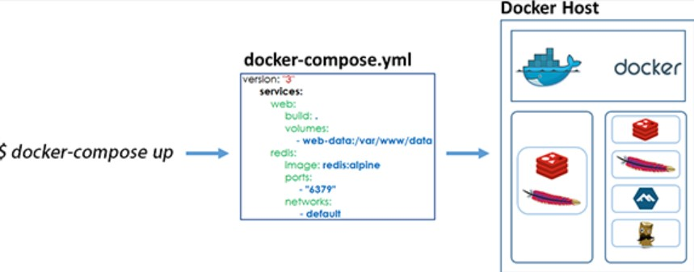

<p align="center">
    
</p>

# Lab 05 - Creando un stack de servicios con docker-compose
<br/>
<p align="center">

<br/>
</p>
<br/>

## Objetivos y resultados
El objetivo de este laboratorio es crear una stack de servicios, es decir, definiciones en un archivo de texto en formato YAML de múltiples servicios además de volúmenes y redes orquestados por **docker-compose**. Para ello, aprovecharemos las imágenes Docker que hemos generado en los laboratorios anteriores. Como resultado, obtendremos un fichero YAML con toda la configuración necesaria para levantar nuestro stack con un solo comando.
<p align="center">

<br/>
</p>
<br/>

## ¿Qué es docker-compose?
Se trata de una herramienta ideal para ejecutar **stacks** de aplicaciones contenerizadas. Por ejemplo, un conjunto de servicios que requieren ser orquestados de forma conjunta. Un caso típico es una aplicación compuesta de un front-end, un back-end y una capa de persistencia. Mediante una definición YAML, se configuran todos los servicios implicados en el stack y, mediante un único comando, permite desplegar el stack completo de servicios.
<br/>
## ¿Cuál es la ventaja de usar docker-compose?
Se trata de un tipo de orquestación de stacks de contenedores. Cuando queremos gestionar distintos servicios que tienen que interactuar entre sí, compose se encarga de mantener los procesos y configurar la red subyacente para que estos estén constantemente **up and running**. Si alguno de los servicios falla, compose se encarga de volver a arrancarlo manteniendo la integridad del stack.
<br/>
## ¿Cómo funciona?
En un fichero docker-compose, es posible definir tres tipos de recursos básicos:
<br/>
**-	Servicios:** la sección de servicios hace referencia a la configuración de los contenedores. Teniendo en cuenta nuestro objetivo final, nuestra sección se servicios estará compuesta por tres servicios contenerizados, un servicio de front, un back y una capa de persistencia.
<br/>
**-	Volúmenes:** hace referencia a un espacio de disco físico que será reservado en el host para persistir la información de uno o varios servicios contenerizados.
<br/>
**-	Redes:** hace referencia a la capa de comunicación que se va a definir para el stack. Aquí se definirán las reglas de comunicación entre los contenedores e incluso entre los contenedores y el host.
<br/>
```version: '3'
services:
  frontend:
    image: my-front
    ...
  backend:
    image: my-back
    ...
  db:
    image: persistence
    ...
volumes:
   my-volume:
networks:
   my-stack-network:
```
## Crear un stack de servicios gestionados por docker-compose.
> Antes de empezar este laboratorio, debemos asegurarnos que los contenedores no estan corriendo ya que al levantar los servicios del stack, podemos encontrarnos con un conflicto de puertos. Para ello, podemos ejecutar el siguiente comando:

```
# Este comando nos devuelve una lista de los contenedores independientemente de su estado
docker ps -a
```
> Si el comando anterior nos devuelve contenedores, para asegurarnos que no existe ningun conflicto, ejecutamos el siguiente comando:

```
# Este comando elimina todos los contenedores independientemente de su estado
docker rm -f $(docker ps -aq)
```
> Podemos observar que eliminar los contenedores no implica eliminar las imágenes o los volumenes que hemos creado anteriormente

```
# Con este comando podemos ver la lista de volúmenes
docker volume ls
```
```
# Con este comando podemos ver la lista de imágenes
docker images
```

### Paso 1. Instalar docker-compose.

> **No es necesario si vamos a trabajar con Play With Docker**

Descarga el paquete
<br/>
```curl -L "https://github.com/docker/compose/releases/download/1.24.1/docker-compose-$(uname -s)-$(uname -m)" -o /usr/local/bin/docker-compose```
<br/>
Aplica permisos de ejecución al fichero binario
<br/>
```chmod +x /usr/local/bin/docker-compose```
<br/>
Añádelo al PATH mediante un enlace simbólico
<br/>
```ln -s /usr/local/bin/docker-compose /usr/bin/docker-compose```
> **Recomendamos usar la versión estable**
> Tras la instalación, ejecuta el siguiente comando:
> ```docker-compose --version```
> Si todo ha ido bien, se mostrará la versión instalada de docker-compose.
<br/>

### Paso 2. Creación de directorio de trabajo.
Cramos una carpeta en el directorio de root
```
mkdir docker-compose
```
### Paso 3. Creación de fichero docker-compose.yaml.
Creamos un fichero docker-compose.yaml usando tu editor de texto favorito.
```
cd docker-compose
vi docker-compose.yaml
```

### Paso 4. Definir la configuración del servicio de frontend.
Para definir la configuración del servicio de frontend, debemos tener en cuenta los siguientes puntos:
<br/>
- Nombre del contenedor
- Hostname
- Nombre de la imagen
- Puerto que expone
```
frontend:
    container_name: frontend
    hostname: frontend
    image: helloworld:latest
    ports:
      - 80:80
```
### Paso 5. Definir la configuración del servicio de backend.
Para definir la configuración del servicio de backend, debemos tener en cuenta los siguientes puntos:
<br/>
- Nombre del contenedor
- Hostname
- Nombre de la imagen
- Variables de entorno
- Puerto que expone
```
 backend:
    container_name: backend
    hostname: backend
    image: spring_boot_app
    environment:
      - SPRING_PROFILES_ACTIVE=db
      - DB_URL=db
    ports:
      - 8080:8080
```
### Paso 6. Definir la configuración del servicio de persistencia.
Para definir la configuración del servicio de persistencia, debemos tener en cuenta los siguientes puntos:
<br/>
- Nombre del contenedor
- Hostname
- Nombre de la imagen
- Puerto que expone
- Mapeo del volumen de persistencia de datos indicando el tipo de volumen, el nombre y el target.
```
 db:
    container_name: db
    hostname: db
    image: postgres:latest
    ports:
      - 5432:5432
    volumes:
      - type: volume
        source: postgres-data
        target: /var/lib/postgresql/data
```
### Paso 7. Definir el fichero YAML completo.
Ahora que tenemos la configuración de los tres servicios, ya podemos definir el docker-compose completo. Guarda fichero como "docker-compose.yaml". Hay que tener en cuenta, que en los ficheros YAML es necesario respetar la identación y no usar tabulaciones.
```
version: '3.2'
services:
 my-frontend:
    container_name: frontend
    hostname: frontend
    image: helloworld:latest
    ports:
      - 80:80
 my-backend:
    container_name: backend
    hostname: backend
    image: spring_boot_app
    environment:
      - SPRING_PROFILES_ACTIVE=db
      - DB_URL=db
    ports:
      - 8080:8080
 db:
    container_name: db
    hostname: db
    image: postgres:latest
    ports:
      - 5432:5432
    volumes:
      - type: volume
        source: postgres-data
        target: /var/lib/postgresql/data
volumes:
  postgres-data:
    external: true
```
> **Recuerda definir el recurso de volúmenes**
### Paso 8. Levantar el stack de recursos.
Para levantar el stack de recursos definido anteriormente, ejecuta el siguiente comando en la ruta donde tengas el fichero docker-compsoe:
<br/>
```docker-compose up -d```
> **Utilizamos el flag "-d" para levantar el stack en modo detached. Si falla, lo mejor será quitar el flag para ver los logs de arranque.**
<br/>
docker-compose irá informando a medida que los diferentes servicios esten levantados.

```
[node1] (local) root@192.168.0.33 ~/docker-compose
$ docker-compose up -d
Creating network "docker-compose_default" with the default driver
Creating db       ... done
Creating backend  ... done
Creating frontend ... done
```
### Paso 9. Comprobamos el estado de los servicios.
Como puedes ver en el log, docker-compose se ha encargado de crear una nueva red para levantar nuestros servicios (docker-compose_default). Es por esto, que todos los servicios que estén en esa red podrán descubrirse mediante hostname.
Al igual que en los casos anteriores, podemos conocer el estado de los servicios mediante los siguientes comandos:

```
[node1] (local) root@192.168.0.33 ~/docker-compose
$ docker-compose ps
  Name                Command              State           Ports         
-------------------------------------------------------------------------
backend    java -jar demo.jar              Up      0.0.0.0:8080->8080/tcp
db         docker-entrypoint.sh postgres   Up      0.0.0.0:5432->5432/tcp
frontend   nginx -g daemon off;            Up      0.0.0.0:80->80/tcp    
```
```
[node1] (local) root@192.168.0.33 ~/docker-compose
$ docker ps
CONTAINER ID        IMAGE                      COMMAND                  CREATED             STATUS              PORTS                    NAMES
7d1f619c3b09        spring_boot_app   "java -jar demo.jar"     8 minutes ago       Up 8 minutes                0.0.0.0:8080->8080/tcp   backend
d5cf55d4bd10        helloworld:latest          "nginx -g 'daemon of…"   8 minutes ago       Up 8 minutes        0.0.0.0:80->80/tcp       frontend
b13347584877        postgres:latest            "docker-entrypoint.s…"   8 minutes ago       Up 8 minutes        0.0.0.0:5432->5432/tcp   db
```
### Paso 10. Comprobamos el mapeo del volumen persistente.
Si utilizamos el comando "docker inspect" podemos observar como nuestra base de datos tiene un volumen mapeado al directorio del volumen persistente que preparamos en el lab04:

```
docker inspect db
```

```
"Mounts": [
            {
                "Type": "volume",
                "Name": "postgres-data",
                "Source": "/var/lib/docker/volumes/postgres-data/_data",
                "Destination": "/var/lib/postgresql/data",
                "Driver": "local",
                "Mode": "rw",
                "RW": true,
                "Propagation": ""
            }
        ]
```

### Paso 11. Comprobamos el funcionamiento de la aplicación.
Hemos comprobado que los servicios se han levantado correctamente y que la BBDD tiene un volumen mapeado, ¿Serías capaz de comprobar si la aplicación funciona correctamente?

### Resumen.
En este laboratorio hemos levantado un stack de servicios dockerizados mediante docker-compose. Esta herramienta ha gestionado de manera automática la generación de los contenedores, la creación de una red común (y aislada) para nuestros servicios, el mapeo de puertos y de volúmenes, mediante la definición de un fichero YAML y la utilización de un solo comando. Si ejecutamos el siguiente comando, podemos ver como docker-compose elimina los recursos generados:
```
[node1] (local) root@192.168.0.33 ~/docker-compose
$ docker-compose down
Stopping db       ... done
Stopping backend  ... done
Stopping frontend ... done
Removing db       ... done
Removing backend  ... done
Removing frontend ... done
Removing network docker-compose_default

```
En este log, docker-compose nos está indicando que está parando cada uno de los servicios, eliminando cada contenedor y eliminando la red que había creado para levantarlos. De esta forma, docker-compose se vuelve una herramienta sumamente útil para aquellas aplicaciones con interdependencias y que necesitan de más servicios para funcionar correctamente.
Como podemos ver, los servicios interactúan entre sí de forma conjunta dentro de una red aislada. Es por eso que, por ejemplo, el backend puede comunicarse con la base de datos mediante nombre del servicio y no es necesario indicar una URL o una IP.

[< Lab 04 - PostgreSQL y volúmenes persistentes con docker](../lab-04) | [Lab 06 - Escalado y orquestración de microservicios >](../lab-06)
<p align="center">
    
</p>
