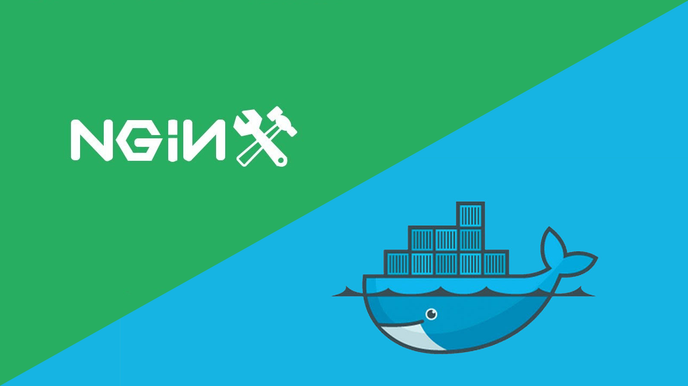

<p align="center">
    
</p>

# Lab 08. Resolución del desafio. Haciendo el despliegue de la aplicación Event-UI con Docker y Nginx

<br/>

<p align="center">

<br/>
¡Despleguemos Event-UI con Docker y Nginx!
</p>
<br/>

## Objetivos y resultados
El objetivo de este laboratorio es resolver el desafio lanzado en el laboratorio [anterior](../lab-07). El desfío consiste en **crear una imagen Docker** que contenga todo lo necesario para desplegar la aplicación web **Event-UI en un servidor Nginx**.

## Punto de partida.

Vamos a partir de la aplicación web **Event-UI** que fue creada para la Openathon IV de Angular. No es necesario conocer como funciona ni como está construida, pero si tienes interés puedes consultar estos links:

* [Even-UI en GitHub](https://github.com/pacobull/event-ui)
* [Openathon IV Angular](https://github.com/Accenture/openathon-2019-angular)

### Paso 1. Clonar el proyecto Event-UI a la máquina virtual

Vamos a clonar el proyecto Event-UI en una nueva máquina virtual. Para ello ejecutaremos el siguiente comando en la carpeta home del usuario:
```sh
cd
git clone https://github.com/pacobull/event-ui.git
```
Como resultado obtendremos lo siguiente:

```sh
$ git clone https://github.com/pacobull/event-ui.git
Cloning into 'event-ui'...
remote: Enumerating objects: 204, done.
remote: Counting objects: 100% (204/204), done.
remote: Compressing objects: 100% (152/152), done.
remote: Total 1315 (delta 97), reused 118 (delta 51), pack-reused 1111
Receiving objects: 100% (1315/1315), 13.46 MiB | 11.75 MiB/s, done.
Resolving deltas: 100% (793/793), done.
```

Cuando finalice la descarga, tendremos una nueva carpeta llamada **event-ui**. Accederemos a su interior con el siguiente comando:
```sh
cd event-ui
```

### Paso 2. Hacer pull de las imágenes Docker que usaremos como base.

Para construir la imagen Docker que contenga nuestra aplicación y el servidor web **Nginx** vamos a utilizar como base otras dos imágenes:

- [Imagen de Node.js](https://hub.docker.com/_/node): Contiene una instalación de Node.js que vamos a necesitar para "compilar" la aplicación.
- [Imagen de Nginx](https://hub.docker.com/_/nginx): Contiene una instalación de Nginx que usaremos como servidor web para publicar nuestra aplicación.

Para hacer el pull de ambas imágenes tan solo tenemos que ejecutar los siguientes comandos en nuestro terminal:

```sh
docker pull node
```

```sh
docker pull nginx
```

Si todo va bien, después de completar la descarga, ambas imágenes deben aparecer en nuestra lista tras ejecutar el siguiente comando:

```sh
docker images
```
Como resultado obtendremos lo siguiente:

```sh
$ docker images
REPOSITORY          TAG                 IMAGE ID            CREATED             SIZE
nginx               latest              c7460dfcab50        2 days ago          126MB
node                latest              f7756628c1ee        3 days ago          939MB
```

### Paso 3. Crear el fichero de configuración para Nginx.

Para que nuestra aplicación Angular se despliegue y funcione correctamente necesitaremos un fichero de configuración básico para el servidor web Nginx. En este fichero, llamado **nginx.conf**, se especifican cosas como el puerto en el que se publicará, la ruta del directorio raíz, las rutas permitidas, etc. En esta [URL](http://nginx.org/en/docs/beginners_guide.html#conf_structure) puedes obtener más detalles sobre su estructura. 

Debemos crear el fichero **nginx.conf** en la carpeta raiz del proyecto con este contenido:

> Recuerda que para crear un fichero nuevo en PlayWithDocker solo tienes que arrastrar el fichero a la consola.

```Nginx
worker_processes  1;
 
events {
  worker_connections  1024;
}
 
http {
  server {
    listen 80;
    server_name  localhost;
 
    root   /usr/share/nginx/html;
    index  index.html index.htm;
    include /etc/nginx/mime.types;
  
    location / {
      try_files $uri $uri/ /index.html;
    }

    location /assets/img/ {
    }
  }
}
```

### Paso 4. Crear el fichero Dockerfile.

También necesitamos un fichero **Dockerfile** para indicar a Docker cuál será el contenido de la nueva imagen que vamos a crear.

Debemos crear el fichero Dockerfile en la carpeta raiz del proyecto con este contenido:

> Recuerda que para crear un fichero nuevo en PlayWithDocker solo tienes que arrastrar el fichero a la consola.

```Dockerfile
# Utilizamos la imagen de node como base ya que la necesitamos para "compilar" los fuentes del proyecto Angular. Denominaremos a esta imagen "build"
FROM node as build

# Copiamos el fichero package.json a una nueva carpeta de trabajo
COPY ./package.json /usr/angular-workdir/
WORKDIR /usr/angular-workdir

# Lanzamos el comando npm install para que node se descargue todas las dependencias
# definidas en nuestro fichero package.json
RUN npm install

# Copiamos todo el código del proyecto a la carpeta de trabajo
COPY ./ /usr/angular-workdir

# Ahora que tenemos todas las dependencias y todo el código podemos generar 
# nuestro entregable ejecutando el siguiente comando.
RUN npm run build

# Llega el momento de preparar el servidor web, para ello usaremos la imagen base
# de Nginx
FROM nginx

# Copiamos el fichero nginx.conf a la ruta adecuada en la imagen nginx
COPY ./nginx.conf /etc/nginx/nginx.conf

# Borramos todos los ficheros que pudieran existir en la ruta donde desplegaremos 
# el desplegable que hemos generado antes 
RUN rm -rf /usr/share/nginx/html/*

# Finalmente copiamos nuestro entregable desde la imagen de node a la ruta de despliegue
# en la imagen de Nginx 
COPY --from=build /usr/angular-workdir/dist/events-ui /usr/share/nginx/html
```

### Paso 5. Crear la nueva imagen a partir del fichero Dockerfile.

Con todos los ingredientes que tenemos, ahora tan solo nos queda pedirle a Docker que siga los pasos descritos en el *Dockerfile* para elaborar la imagen, como si de una receta de cocina se tratase. Para ello usaremos el comando *build*.

```sh
docker build -t event-ui .
```

La ejecución puede tardar más de un minuto e irá mostrando el resultado de la ejecución de cada uno de los pasos incluidos en el fichero Dockerfile. 

> Es posible que se muestre algún mensaje de Warning pero podemos ignorarlos.

Si todo va bien, nuestra nueva imagen aparecera, junto a las de node y nginx, en nuestra lista de imágenes si ejecutamos el siguiente comando:
```sh
docker images
```
Como resultado obtendremos lo siguiente:

```sh
[node1] (local) root@192.168.0.48 ~/angular-app
$ docker images
REPOSITORY          TAG                 IMAGE ID            CREATED             SIZE
event-ui            latest              8e2c8f5db72c        20 seconds ago      169MB
<none>              <none>              1e850e1d09a5        26 seconds ago      1.6GB
nginx               latest              c7460dfcab50        2 days ago          126MB
node                latest              f7756628c1ee        3 days ago          939MB
```

> La imagen identificada como < none > es una imagen temporal que se ha creado en este proceso.

### Paso 6. Ejecutar nuestra nueva imagen para generar un nuevo contenedor.

Ahora que tenemos lista nuestra nueva imagen docker tan solo nos queda ejecutarla y crear así nuestro contenedor que arrancará el servidor web Nginx con nuestro Event-UI.

Para ellos vamos a ejecutar el siguiente comando:
```sh
docker run -d -p 80:80 event-ui
```

Si todo va bien, en el panel superior de la máquina virtual se mostrará junto al botón *OPEN PORT* un nuevo enlace indicando que la aplicación está publicada en el **puerto 80**. Si pulsamos el enlace se abrirá una nueva pestaña donde podremos ver nuestra aplicación **Event-UI**.

<p align="center">
  
  <br/>
  ¡Event-UI desplegado en Nginx!
</p>

También podemos ver que nuestro nuevo contenedor está en ejecución con el siguiente comando:
```sh
docker ps
```

Como resultado obtendremos lo siguiente:
```sh
[node1] (local) root@192.168.0.48 ~/angular-app
$ docker ps
CONTAINER ID        IMAGE               COMMAND                  CREATED             STATUS              PORTS                NAMES
7ed0c8cec8e3        event-ui            "nginx -g 'daemon of…"   7 minutes ago       Up 7 minutes        0.0.0.0:80->80/tcp   xenodochial_archimedes
```

<br/>

### Paso 7. Detener y eliminar el contenedor.

Como paso final, después de haber disfrutado de esta magnífica aplicación :), vamos a parar y eliminar el contenedor con el siguiente comando:

```sh
docker rm -f event-ui
```

Y verificamos que ya no está en ejecución con este otro:

```sh
docker ps
```

## Resumen
Hemos clonado una aplicación web hecha con Angular. Hemos creado una nueva imagen a partir otras dos (Node y Nginx) y en ella hemos incluido un servidor Nginx que publica nuestra aplicación web. Luego hemos generado un contenedor a partir de esa imagen y hemos comprobado que la aplicación se publica tal y como esperábamos.

< [Lab 07 - Dockerización de la aplicación Event-UI. (Reto para poner la guinda al pastel)](../lab-07)

<p align="center">
    
</p>

